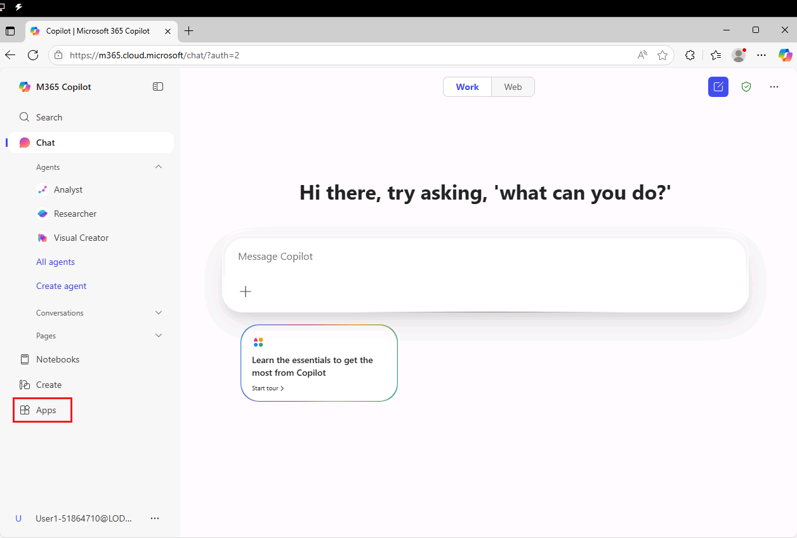

**실습0: 실습 실행 준비하기**

**1. 실습 가상 머신에 로그인합니다**

로그인 화면에서 화면 왼쪽 하단에 있는 **Admin** 계정을 선택하여 오른쪽
**Resources ta**의 **Win 11 Base23B-22H2** 에서 제공된 자격 증명을
사용하여 실습 가상 머신에 로그인합니다(스크린샷 참조).

**참고**: **Student** 로그인을 사용하지 마세요.

**참고**: 실습 연습에 사용되는 참고 문서는 **C:\LabFiles**에 있습니다.
실습 환경을 시작할 때 스크린샷과 같은 메시지가 표시될 수 있습니다. 파일
다운로드 버튼을 클릭하여 참고 문서 다운로드를 완료하세요.

**2. Microsoft 365 구독 설정 완료 및 Microsoft 365 Copilot
액세스합니다**

1.  Microsoft Edge 브라우저를 열고 다음 URL을
    입력합니다: +++<https://m365.cloud.microsoft>+++

2.  오른쪽 **Resources tab** 의 Azure Portal 섹션에서 제공된 자격 증명을
    사용하여 로그인합니다(스크린샷 참조).

이제 모든 Microsoft 365 애플리케이션에 액세스할 수 있고 Microsoft 365
Copilot 앱과 Copilot 채팅에 액세스할 수 있습니다.

**3. Microsoft 365 애플리케이션에 액세스하고 시작합니다.**

**앱 아이콘**(왼쪽 탐색 창)에서 생산성 애플리케이션에 액세스하고 실행할
수 있습니다.

1.  **앱 아이콘**에서 애플리케이션을 실행하려면:

왼쪽 하단의 탐색 창에서 앱 아이콘을 선택하여 작업에 필요한 Office 응용
프로그램을 선택하고 엽니다.

2.  원하는 애플리케이션을 찾을 수 없는 경우, **Install apps** 또는 **All
    apps** 을 클릭하여 원하는 애플리케이션을 선택합니다.

**4. 실습 자료를 OneDrive에 업로드합니다**

이 실습의 실습 세션에서 사용할 실습 자료(참조 문서)는 **C:\LabFiles**에
있습니다.

**참고**: Copilot 프롬프트에서 파일(Word 문서, Excel 파일 등)을 참조해야
하는 경우, 해당 파일은 반드시 OneDrive 계정에 저장해야 합니다. PC에
로컬로 저장된 파일에는 연결할 수 없습니다.

1.  **Apps** 페이지에서 **OneDrive**를 선택하여 엽니다.

2.   **My files**를 선택합니다. 

3.  C:\LabFiles\MS4019 폴더로 이동하여 해당 문서 사본을 선택하여
    OneDrive에
    업로드합니다. 

**참고**: 모든 문서 사본을 업로드하거나 특정 연구실과 관련된 문서만
업로드할 수 있습니다.

이제 **Microsoft 365 Copilot** 실습에서 작업할 수 있는 문서가
**OneDrive**에 저장되었습니다.

**5.** 문서 라이브러리(Teams 채널)를 만들고 지식 소스를 업로드합니다.

실습 실습 세션에서 참조 문서로 사용할 지식 리소스를 업로드하려면 Teams
채널의 문서 라이브러리를 사용하게 됩니다.

1.  **Apps** 페이지에서 **Teams**을 선택합니다.

2.  **Get Started**를 클릭합니다.

3.  왼쪽 탐색 창에서 **Teams**을 선택합니다.

4.  **Contoso Public**에서 **Join Team**을 클릭합니다.

5.  **Teams** 섹션으로 돌아가서 **General**.을 ​​선택하세요. 이 항목은
    참조 문서가 업로드될 문서 라이브러리입니다.

**참고**: 파일이 자동으로 업로드될 때까지 잠시 기다려 주세요. 파일이
보이면 **Lab 01**로 진행해 주세요.

파일이 보이지 않으면 **6단계로** 진행하세요.

6.  **Files**를 선택합니다.

7.  **Upload**를 클릭하고 **Files**을 선택합니다.

8.  **C:\LabFiles\MS4019**로 이동합니다.

9.  **Contoso CipherGuard Product Specification**  및 **Trey Research -
    VPN Technical Overview** 를 선택하여 문서 라이브러리에 업로드합니다.

이제 문서 라이브러리를 만들고 지식 소스로 사용할 참조 문서를
업로드했습니다.

